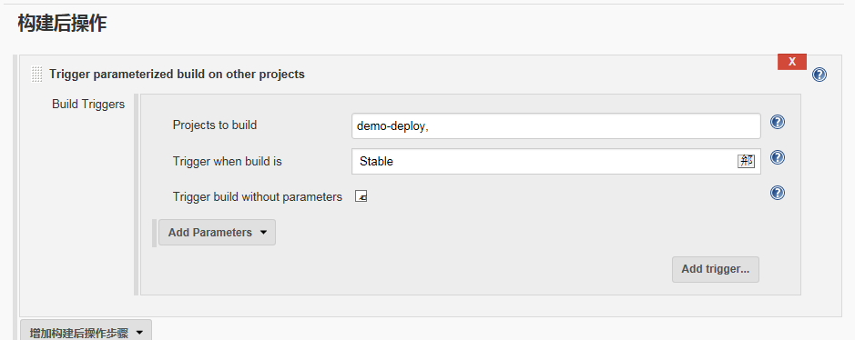

#自动化代码部署应用
---
## 一 环境规划  
> 1.1 开发环境 （开发本地的环境）  
> 1.2 测试环境 （功能测试和性能测试）        
> 1.3 预生产环境  （和生产环境配置一样，也可以生产环境某一个节点）    
> 1.4 生产环境       

## 二 设计生产自动化部署  
> 2.1 规划    
> 2.2 实现    
> 2.3 总结和扩展    
> 2.4 在生产环境应用        

### 2.1.1 规划 
> 2.1.2 集群有50个节点    
> 2.1.3 实现一键部署50个节点     
> 2.1.4 一键回滚到任意版本       
> 2.1.5 一键回滚到上一个版本
### 2.1.5.1 部署 回滚    
> 2.1.5.2部署：    
> 1.代码在哪里    
> 2.获取什么版本的代码             
<pre>
    Svn+git直接拉取某个分支
    Svn:指定版本号
    git：指定tag     
</pre>
> 3.差异解决：
<pre>
   1.各个节点直接差异，配置文件未必一样：crontab.xml 
   2.代码创库和实际的差异，配置文件是否放在代码创库中     
</pre>
> 4.如何更新: java tomcat 需要重启 
> 5.测试  
> 6.穿行和并行 分组部署   
> 7.如何执行  shell ./ 执行   Web界面    
## 三  代码上线流程
> 3.1 获取代码（直接拉取）   
> 3.2 编译 （可选）  
> 3.3 配置文件放进去 （和9有关）
> 3.4 打包
> 3.5 scp到目标服务器   
> 3.6 将目标服务器异除集群   
> 3.7 减压       
> 3.8 放到webroot目录    
> 3.9 scp差异文件     
> 3.10 重启 （可选）    
> 3.11 测试      
> 3.12 将目标服务器加入集群       

1. 用户 所有的web服务，都应该使用普通用户  
2. 所有的web服务都不应该监听80端口，除了负载均衡     
## 2.2.2 操作步骤  
<pre>
# useradd www
# ssh-keygen -t rsa
# vim authorized_keys
# chmod 600 authorized_keys  
# vim deploy.sh #编辑部署  
------------------------------------
#  cat deploy.sh # 脚本框架
#!/bin/bash
#------------------------------------
#date:14:17 2016-8-11               
#Author: created by genglei         
#Mail:genglei@yonyou.com                                              #
#Function: deploy               
#Version: 1.1                        
#------------------------------------

# Shell Env
SHELL_NAME="deploy.sh"
SHELL_DIR="/home/www/"
SHELL_LOG="${SHELL_DIR}/${SHELL_NAME}.log"

# Code Env 目录相关 
CODE_DIR="/deploy/code/web-demo" #项目路径
CONFIG_DIR="/deploy/config"
TMP_DIR="/deploy/tmp"
TAR_DIR="/deploy/tar"
LOCK_FILE="/tmp/deploy.lock"

# 提示
usage(){
        echo $"Usage: $0 [ deploy | rollback ]" 
}

# 加锁，我在执行的时候别人不能再次执行
shell_lock(){
        touch $LOCK_FILE
}

# 解锁
shell_unlock(){
        rm -f ${LOCK_FILE}

}

#代码获取
code_get(){
        echo code_get
        sleep 60;
}

#代码编译
code_build(){
        echo code_build

}

#代码放进去
code_config(){
        echo code_config

}

#打包
code_tar(){
        echo code_tar

}
#scp到目标服务器
code_scp(){
        echo code_scp

}
#将目标服务器异除
cluster_node_remove(){
        echo cluster_node_remove

}
#减压_放到webroot目录
code_deploy(){
        echo code_deploy

}
#scp差异文件
config_diff(){
        echo config_diff

}
#测试
code_test(){
        echo code_test

}
#加入集群
cluster_node_in(){
        echo cluster_node_in

}

#回滚函数
rollback(){
        echo rollback

}
#主函数
main(){
   if [ -f ${LOCK_FILE} ];then
        echo "Deploy is running" && exit;
    fi
     DEPLOY_METHOD=$1
     case $DEPLOY_METHOD in
        deploy) shell_lock;
                code_get;
                code_build;
                code_config;
                code_tar;
                code_scp;
                cluster_node_remove;
                code_deploy;
                config_diff;
                code_test;
                cluster_node_in;
                shell_unlock;
                ;;
        rollback)
                shell_lock;
                rollback;
                shell_unlock;
                ;;
        *)
                usage;
     esac
}
main $1

---------------------

git clone git@linux-node1:web/web-demo.git
23:13:00
Mr. L 2016/8/12 23:13:00
git add *

Mr. L 2016/8/12 23:13:09
git commit -m "add index.html"

Mr. L 2016/8/12 23:13:26

Mr. L 2016/8/12 23:14:08
git config --global user.email "Administrator" 

Mr. L 2016/8/12 23:14:31
git config --global user.name "Your Name"
23:15:30
Mr. L 2016/8/12 23:15:30
git commit -m "add index.html"                
[master f076349] add index.html
 1 file changed, 1 insertion(+)
 create mode 100644 index.html

Mr. L 2016/8/12 23:15:50
git push
23:18:32
Mr. L 2016/8/12 23:18:32
git show
commit f076349cc1483010499cdb54a8ad894e720a872a
Author: Your Name <Administrator>
Date:   Sat Aug 13 07:10:39 2016 +0800

    add index.html

diff --git a/index.html b/index.html
new file mode 100644
index 0000000..a78773d
--- /dev/null
+++ b/index.html
@@ -0,0 +1 @@

Mr. L 2016/8/12 23:19:26
git show|grep commit | cut -d ' ' -f2
f076349cc1483010499cdb54a8ad894e720a872a
23:22:43
Mr. L 2016/8/12 23:22:43
API_VERL=$(git show|grep commit | cut -d ' ' -f2)
echo ${API_VERL:0:6}

Mr. L 2016/8/12 23:23:33
API_VER=$(echo ${API_VERL:0:6})
echo $API_VER
23:42:44
Mr. L 2016/8/12 23:42:44
---------
vim index.html
git add *
git commit -m "v2.0"
git push 

</pre>

# 一 持续集成JenKins安装部署    

### 1.1 安装JDK  
<pre>
yum install -y java-1.8.0
# jenkins是java编写的，所以需要安装jdk，这里采用yum安装，如果对版本有要求，可以直接在oracle官网下载JDK

</pre>

# 二 安装JeKins
<pre>
# cd /etc/yum.repos.d/
# wget http://pkg.jenkins.io/redhat/jenkins.repo
# rpm --import http://pkg.jenkins.io/redhat/jenkins.io.key
# yum install -y jenkins
# systemctl start jenkins
</pre>
### 2.4 访问JenKins   
> 在浏览器输入htpp://192.168.56.14:8080 
 
### 2.5 为了安全考虑，首先需要解锁Jenkins，请在/var/lib/jenkins/secrets/initialAdminPassword中查看文件
<pre>
cat /var/lib/jenkins/secrets/initialAdminPassword
98dc4fdeb47641bf93bfbd884d0d9b7f
</pre>  
### 2.6 选择需要安装的插件

### 2.7 由于网络原因，有一些插件会安装失败

### 2.8 设置Admin用户和密码

### 2.9 登录jenkins

---
---
---

# 一 gitlab-ce安装

> GitLab是一个利用Ruby on Rails 开发的开源应用程序，实现一个自动托管git项目创库，可通过Web界面进行访问公开的或者私人项目，GitLab拥有与Github类似的功能，能够浏览源代码，管理缺陷和注释。可以管理团队对仓库的访问，它非常易于浏览提交过的版本并提供一个文件历史库。它还提供一个代码片段收集功能可以轻松实现代码复用，便于日后有需要的时候进行查找。   

## 二 基础环境准备  
<pre>
# yum install curl policycoreutils openssh-server openssh-clients postfix
# systemctl start postfix

</pre>

## 二 安装gitlab-ce
<pre>
# curl -sS https://packages.gitlab.com/in ... pm.sh | sudo bash
# yum install -y gitlab-ce
注：由于网络问题，国内用户，建议使用清华大学的镜像源进行安装：  

# vim /etc/yum.repos.d/gitlab-ce.repo
[gitlab-ce]
name=gitlab-ce
baseurl=http://mirrors.tuna.tsinghua.e ... m/el7
repo_gpgcheck=0
gpgcheck=0
enabled=1
gpgkey=https://packages.gitlab.com/gpg.key
# yum makecache #将服务器上的软件包信息 现在本地缓存,以提高 搜索 安装软件的速度
# yum install gitlab-ce  # 安装gitlab
</pre>  
### 2.1 配置并启动gitlab-ce   
<pre>       
# gitlab-ctl reconfigure        
</pre>
### 2.2 查看gitlab状态   
<pre>
# gitlab-ctl status
run: gitlab-workhorse: (pid 3051) 25s; run: log: (pid 2951) 56s
run: logrotate: (pid 2970) 52s; run: log: (pid 2969) 52s
run: nginx: (pid 2958) 54s; run: log: (pid 2957) 54s
run: postgresql: (pid 2806) 114s; run: log: (pid 2805) 114s
run: redis: (pid 2723) 120s; run: log: (pid 2722) 120s
run: sidekiq: (pid 2941) 62s; run: log: (pid 2940) 62s
run: unicorn: (pid 3082) 9s; run: log: (pid 2908) 68s
</pre>
### 2.3 登录gitlab 
> 第一次登录gitlab，需要为root用户修改密码,root用户也是gitlab的超级管理员    
 
 
   
### 2.4 管理gitlab 使用root用户和刚才创建的密码登录后，
           
---
---
# 一 sonar部署
> Sonar 是一个用于代码质量管理的开放平台。通过插件机制，Sonar 可以集成不同的测试工具，代码分析工具，以及持续集成工具。与持续集成工具（例如 Hudson/Jenkins 等）不同，Sonar 并不是简单地把不同的代码检查工具结果（例如 FindBugs，PMD 等）直接显示在 Web 页面上，而是通过不同的插件对这些结果进行再加工处理，通过量化的方式度量代码质量的变化，从而可以方便地对不同规模和种类的工程进行代码质量管理。
        在对其他工具的支持方面，Sonar 不仅提供了对 IDE 的支持，可以在 Eclipse 和 IntelliJ IDEA 这些工具里联机查看结果；同时 Sonar 还对大量的持续集成工具提供了接口支持，可以很方便地在持续集成中使用 Sonar。
此外，Sonar 的插件还可以对 Java 以外的其他编程语言提供支持，对国际化以及报告文档化也有良好的支持。        
[Sonar的相关下载和文档可以在下面的链接中找到](http://www.sonarqube.org/downloads/)       
<pre>
# yum install -y java-1.8.0
# cd /usr/local/src
# wget https://sonarsource.bintray.co ... 6.zip
# unzip sonarqube-5.6.zip
# mv sonarqube-5.6 /usr/local/
# ln -s /usr/local/sonarqube-5.6/ /usr/local/sonarqube
---
使用yum安装MySql5.6.24 #sonar至少用5.6的数据库
# rpm -Uvh http://dev.mysql.com/get/mysql-community-release-el7-5.noarch.rpm
# yum -y install mysql-community-server 

# 准备Sonar数据库

mysql> CREATE DATABASE sonar CHARACTER SET utf8 COLLATE utf8_general_ci;
mysql> GRANT ALL ON sonar.* TO 'sonar'@'localhost' IDENTIFIED BY 'sonar@pw';
mysql> GRANT ALL ON sonar.* TO 'sonar'@'%' IDENTIFIED BY 'sonar@pw';
mysql> FLUSH PRIVILEGES;

# 配置Sonar
# cd /usr/local/sonarqube/conf/
# ls
sonar.properties  wrapper.conf

# 编写配置文件，修改数据库配置
# vim sonar.properties
sonar.jdbc.username=sonar
sonar.jdbc.password=sonae@pw
sonar.jdbc.url=jdbc:mysql://localhost:3306/sonar?useUnicode=true&characterEncoding=utf8&rewriteBatchedStatements=true&useConfigs=maxPerformance

# 配置Java访问数据库驱动(可选)
    默认情况Sonar有自带的嵌入的数据库，那么你如果使用类是Oracle数据库，必须手动复制驱动类到${SONAR_HOME}/extensions/jdbc-driver/oracle/目录下，其它支持的数据库默认提供了驱动。其它数据库的配置可以参考官方文档：
http://docs.sonarqube.org/display/HOME/SonarQube+Platform

# 启动Sonar
    你可以在Sonar的配置文件来配置Sonar Web监听的IP地址和端口，默认是9000端口。
# vim sonar.properties
sonar.web.host=0.0.0.0
sonar.web.port=9000
# /usr/local/sonarqube/bin/linux-x86-64/sonar.sh start

</pre>

### 2.1 访问sonar http://192.168.56.14:9000

### 2.2 汉化sonar 

### 3.1 实现自动构建，#在本地提交代码，gitlab自动调用jenkins

### 3.1.1 jenkins操作如下：
<pre>
jenkins插件如下：
Gitlab Hook Plugin 钩子脚本
Build Autho   身份验证令牌
#通过gitlab-WEB-HOOKS验证 http://115.28.156.214/jenkins/buildByToken/build?job=demo-sonar&token=6df9837a314024a3f8c3
Gitlab Plugin 
Build Pipeline
Parameterized Trigger plugin  a项目完成自动构建b项目
</pre>

### 3.1.2 git简单操作如下：
<pre>
git clone git@gitlab.chaoke.ren:web/web-demo.git
git add *
git commit -m "add index.html"
git push 上传
git pull 下载
-----------------------------------------------------------------
echo "# gitlab_jenkins" >> README.md
git init
git add README.md
git commit -m "first commit"
git remote add origin git@github.com:GENGLEIN/gitlab_jenkins.git
git push -u origin master
生成随机码 openssl rand -hex 10
-----------------------------------------------------------------

</pre>

### 3.1.3 截图如下：

  

#说明 :
> jenkins拉取gitlab代码，gitlab在项目下配置deploy keys---jenkins的公钥
> 在jenkins上写上gitlab项目的地址然后选择add-jenkins-SSH Uername with private key 填写jenkins的秘钥

